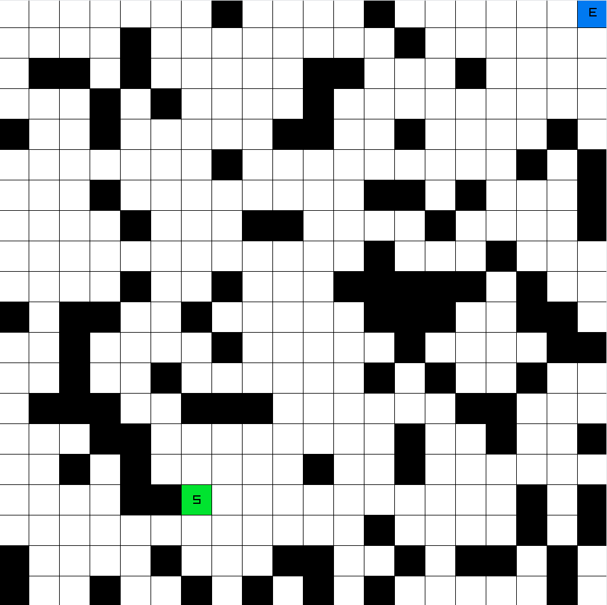
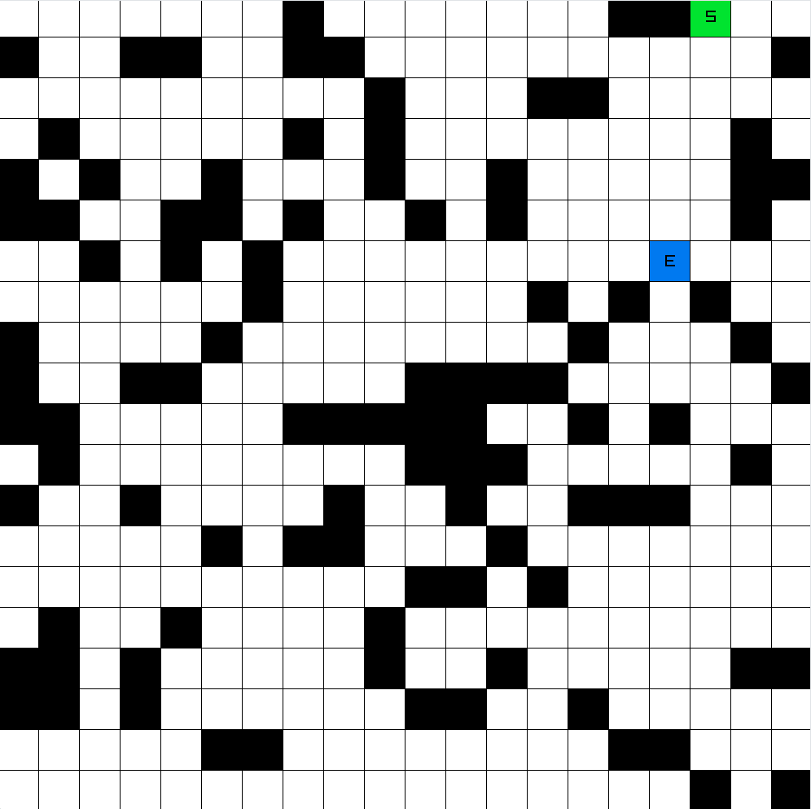
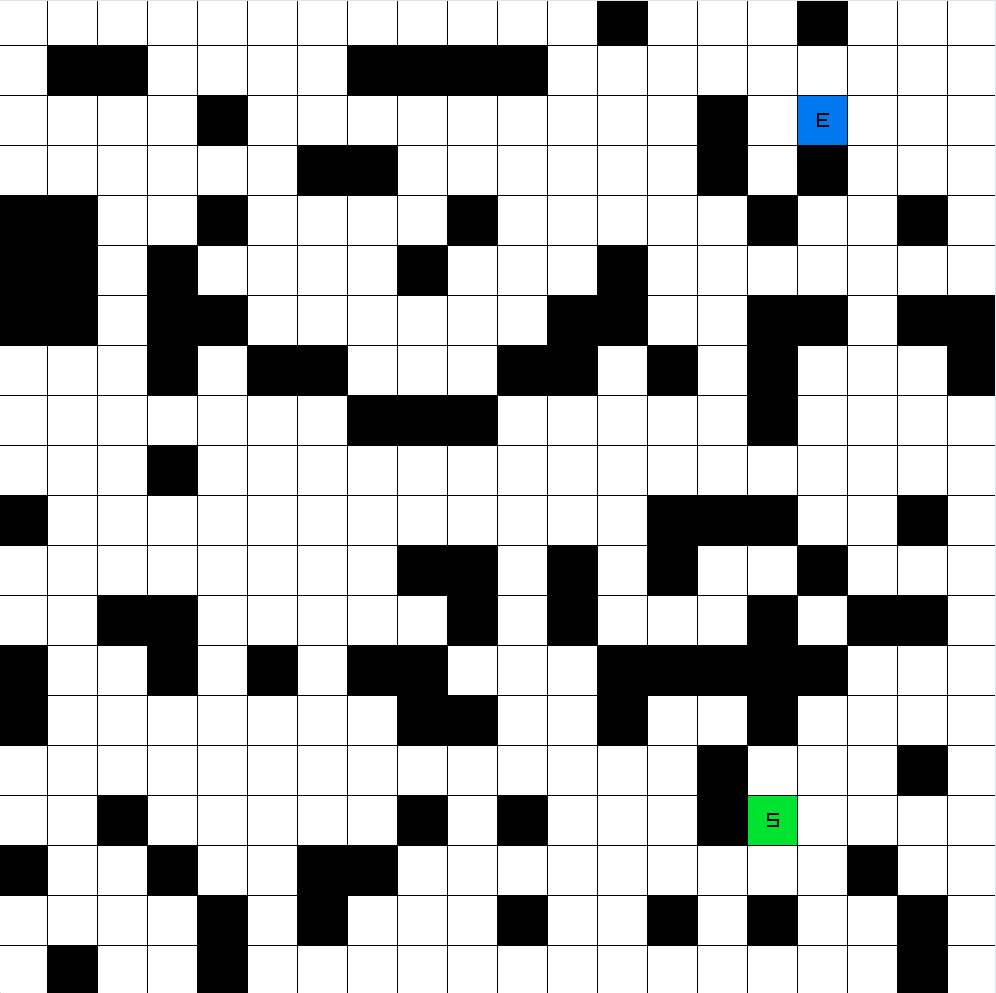
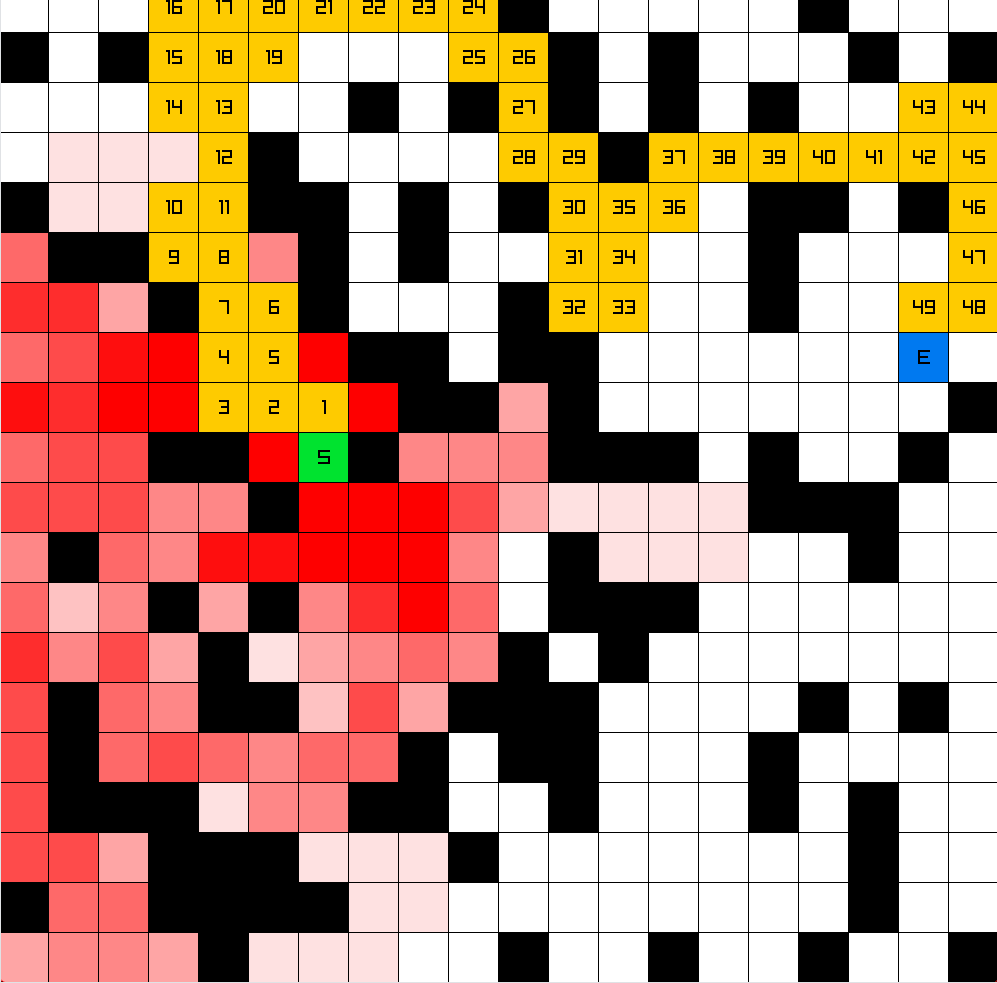

# Ai Pathfinding

A C++ and Raylib implementation visualizing various pathfinding algorithms on a 2D grid.

## Visualizations

<table>
  <tr>
    <td>
      <h3>Bfs</h3>
      
    </td>
    <td>
      <h3>Dfs</h3>
      
    </td>
  </tr>
  <tr>
    <td>
      <h3>AStar</h3>
      
    </td>
    <td>
      <h3>RandomSearch</h3>
      
    </td>
  </tr>
</table>

## Mechanics
* Grid Generation: Generates a 20x20 grid where 25% of the nodes are randomly designated as solid black obstacles. 
* Bfs: Layer-by-layer exploration using a FIFO queue. Explored nodes animate in light blue, and the final shortest path is traced sequentially in gold.
* Dfs: Deep branch exploration using a LIFO stack. Explored nodes animate in purple, tracing the discovered path in gold once the end node is hit.
* Djikstra: Evaluates paths utilizing a priority queue based on ground cost. Functions identically to Bfs in this implementation due to uniform grid weights. Explored nodes animate in dark green.
* AStar: Heuristic-based pathfinding utilizing grid coordinates to calculate optimal paths. Explored nodes animate in pink, prioritizing nodes closest to the end point.
* RandomSearch: A naive random walk that selects unvisited neighbors, resetting from the start node if it reaches a dead end.

## Controls
* B: Execute Bfs.
* D: Execute Dfs.
* J: Execute Djikstra.
* A: Execute AStar.
* R: Execute RandomSearch.
* X: Regenerate map obstacles and randomize Start (S) and End (E) positions.

## Technical Structure
* Node (Node.h): Represents an individual tile grid cell. Manages traversal state variables (visited, parent pointer, step count) and handles node-scaling render animations.
* State Machine (Ai.h / Ai.cpp): Manages the core game loop, input polling, grid generation logic, and steps through the active search algorithm state.