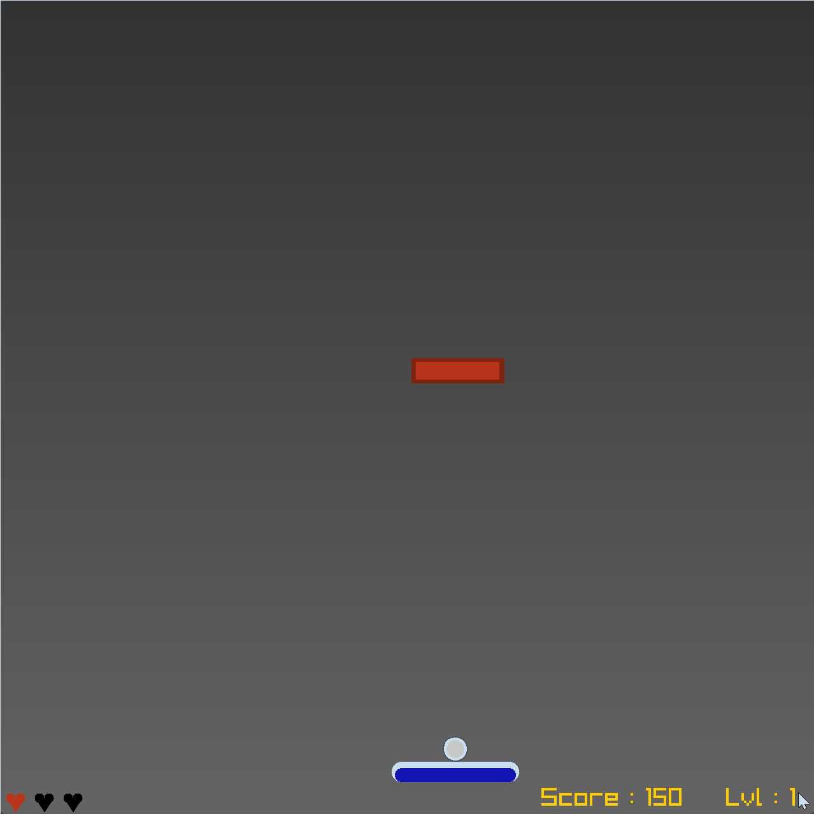

# WallBreaker

A C++ and Raylib implementation of a classic brick-breaking arcade game.

## Overview
This project is an object-oriented 2D game where the player controls a paddle to bounce a ball, destroying brick formations across multiple levels. It features state management, collision detection, and user interface rendering using the Raylib framework.

## Mechanics
* **State Management:** The game transitions between Play, Paused, Game Over, and Win states.
* **Progression:** Includes three distinct hardcoded levels (rows, small circle, large circle). The level advances automatically when all bricks are cleared.
* **Lives and Scoring:** The player has a limited number of lives. Destroying bricks increases the score. Losing all lives triggers a Game Over.
* **Physics and Polish:** The ball features a dynamic visual trail and speed scaling. The paddle includes a visual bounce effect upon ball impact. Ball reflection angles are influenced by where it strikes the paddle.

## Controls
* `A` / `D`: Move paddle left / right.
* `SPACE`: Launch ball from the paddle.
* `P`: Pause the game.
* `LMB`: Interact with UI buttons (Resume, Restart).
* `=`: Skip current level (Debug).

## Technical Structure
* **WallBreaker:** The core class managing the game loop, initialization, and overarching logic.
* **Entities:** Modular classes (`Player`, `Ball`, `Brick`) handle their own specific logic.
* **UiManager:** Handles rendering of text, score, lives, and interactive buttons based on the current game state.
