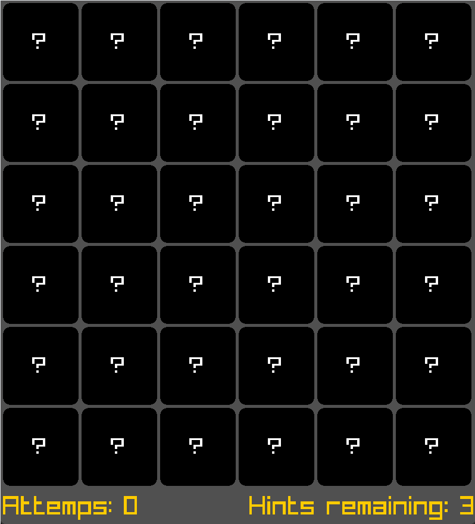

# Memory Card Flip

A C++ and Raylib implementation of a classic memory matching game.

## Overview
This project is a grid-based puzzle game where the player clicks to flip hidden cards and find matching pairs of numbers. Built utilizing standard C++ vectors and the Raylib framework for rendering and input handling.

## Mechanics
* **Grid Generation:** Automatically generates pairs of numbers and randomly distributes them across a scalable grid (defaulting to 6x6).
* **Matching Logic:** The player selects two hidden cards. If the values match, they lock into a matched state and display a smiley face. If they differ, a red timer bar appears at the top of the window, and the cards flip back over after a brief delay.
* **Tracking & Hints:** The user interface tracks total attempts. Players start with 3 hints; activating a hint temporarily reveals the entire board for 5 seconds while a countdown timer is displayed.
* **Win Condition:** The game constantly checks the board state and transitions to a win screen once all cards are matched.

## Controls
* `LMB`: Click a hidden card to flip it.
* `H`: Consume a hint to temporarily reveal all cards.
* `W`: Automatically match all cards (Debug).

## Technical Structure
* **State Management:** Utilizes enumerations to track overarching game states (`play`, `win`, `hint`) as well as individual card states (`hidden`, `flipped`, `matched`).
* **Card:** Handles individual card bounding boxes, click detection, and dynamic text centering based on its current state.
* **MemoryCardFlip:** The primary controller class that handles deck shuffling, frame updates, timer countdowns, and rendering the UI elements.
