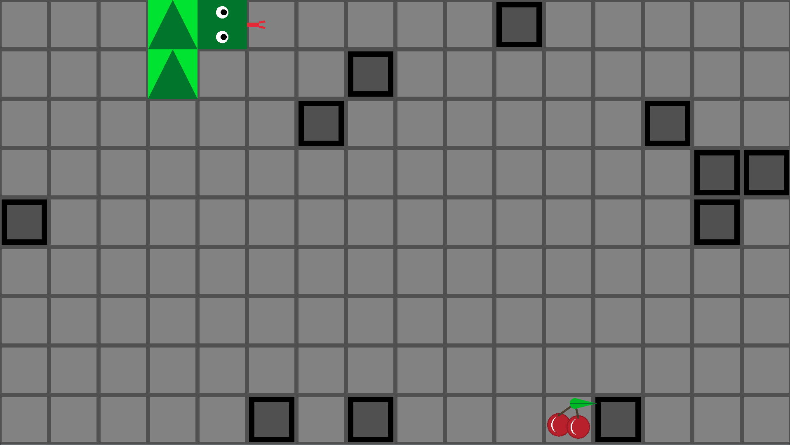

# Snake Game

A C++ and Raylib implementation of the classic Snake arcade game featuring procedural obstacles and an A* autonomous autopilot mode.

## Overview
This project is a grid-based game where the player controls a growing snake, attempting to consume fruit to increase score and length without colliding with walls, obstacles, or themselves. The game features manual player control alongside a "Magic Mode" that utilizes an A* search algorithm to navigate the grid autonomously.

## Mechanics
* **Grid & Procedural Obstacles:** The game board maps to a strict tile grid. Upon initialization, static obstacles (blocked tiles) are generated randomly across the board (1 in 16 chance per tile).
* **Growth & Spawning:** * **Food Pickup:** Consuming cherries increases tail length and grants 25 points.
  * **Magic Pickup:** Spawns and despawns cyclically every 5 seconds. Consuming it awards 200 points and activates Magic Mode.
* **Magic Mode (A* Autopilot):** Temporary state lasting between 5 to 10 seconds. Manual input is suspended, and the snake utilizes an A* pathfinding routine to automatically track down food. The pathfinding logic treats the snake's own body segments and the procedural grid walls as blocked nodes.
* **Collision & States:** The game monitors for out-of-bounds containment, self-intersection, and wall collisions. Crashing triggers a Game Over state. A victory state triggers if the snake fills the entire legal grid area.

## Controls
* `W` / `A` / `S` / `D`: Change direction (Up, Left, Down, Right) during manual play.
* `P`: Pause / Unpause the game.
* `R`: Restart the game (available during Game Over).

## Visuals & Polish
* **Procedural Rendering:** Rendered entirely via Raylib primitives, including distinct geometry for fruit stems, leaves, and a directional snake tongue.
* **Directional Indicators:** Body segments render as oriented triangles pointing in their current vector of movement.
* **Magic State Feedback:** The Magic Fruit shifts color dynamically across the HSV spectrum. When Magic Mode is active, an alpha-blended countdown timer overlay displays on screen and the snake's eyes glow with the shifting color matrix.

## Technical Structure
* **SnakeGame:** Central state machine running the window context, input evaluation, score handling, and grid layout.
* **Player & Piece:** Encapsulates snake data inside a `std::vector<Piece>`. Positional transforms ripple sequentially from the head down the vector chain per physics step.
* **AStar:** Specialized utility struct running graph searches. Evaluates Manhattan distance as its heuristic to compute the optimal orthogonal step towards targets.
* **Pickup Hierarchy:** Abstract base class managing spatial coordinates and deployment flags, subclassed into concrete `FoodPickup` and `MagicPickup` types to implement polymorphism for custom behaviors and rendering rules.