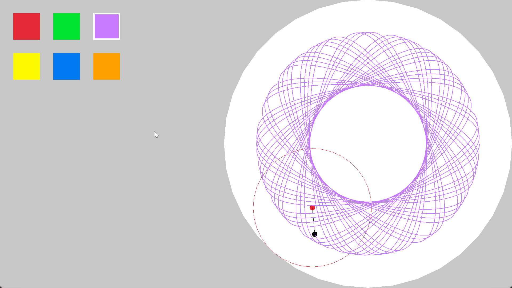

# SpiroGraph

A C++ and Raylib implementation of a digital spirograph drawing tool.

## Mechanics
* Simulates a pen attached to a wheel rolling inside a larger canvas circle.
* Calculates pen position using trigonometric functions over time.
* Stores each point as a `TrailSegment` to render continuous lines.
* Provides interactive UI buttons to change the active pen color.
* Buttons display a brightness change on hover and a white outline when selected.

## Controls
* `LMB` (Edge of canvas): Adjust the main canvas radius.
* `LMB` (Color palette): Select a new drawing color.
* `Left Arrow` / `Right Arrow`: Decrease or increase the pen offset.
* `Space`: Clear the drawing trail and reset the time variable.

## Technical Structure
* `SpiroGraph`: Manages the application loop, inputs, wheel calculations, and rendering.
* `TrailSegment`: A structure containing the color, position, and thickness of each drawn line segment.
* `Button`: A class managing interactive rectangular UI elements for color selection.