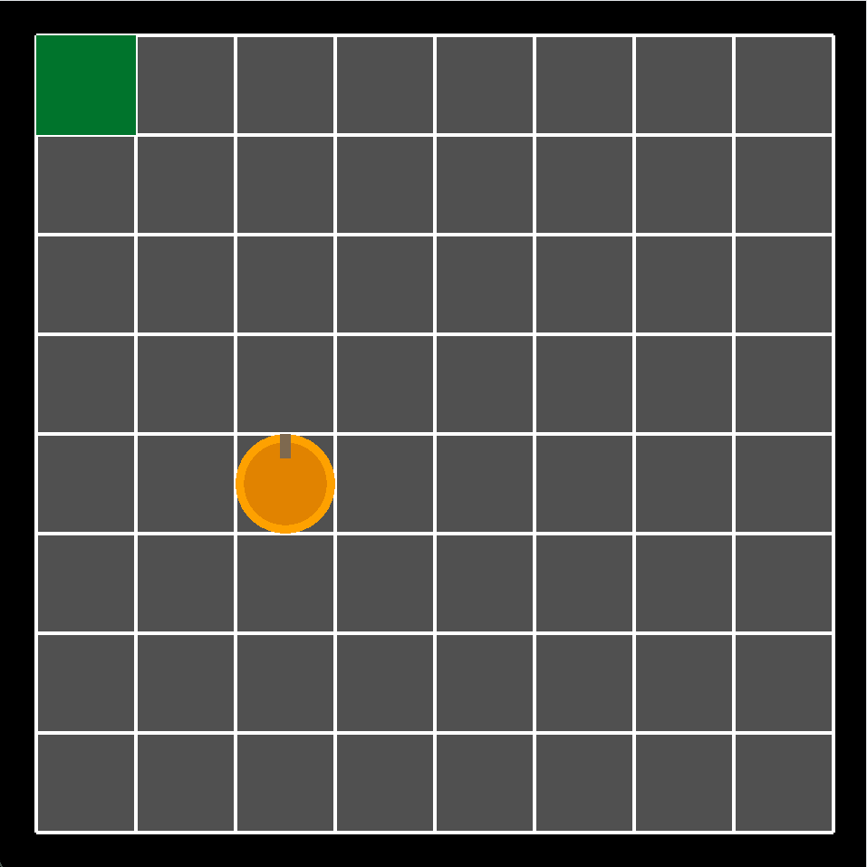

# Snake Game

A C++ and Raylib implementation of the classic Snake arcade game.

## Overview
This project is a grid-based game where the player controls a growing snake, attempting to consume fruit to increase their score and length without colliding with the walls or themselves. Built using standard C++ vectors and the Raylib framework.

## Mechanics
* **Grid Movement:** The snake (`Player`) moves on a strict grid defined by `TILE_SIZE`. Movement updates sequentially across all body segments (`Piece`).
* **Growth & Spawning:** Consuming an orange pickup (fruit) increases the tail length. The pickup logic explicitly verifies the snake's current footprint to prevent spawning inside the player.
* **Collision & States:** The game detects out-of-bounds collisions and self-intersections, triggering a Game Over state. The game can also be paused, and features a win state if the snake fills the entire grid.
* **Visual Polish:** The snake features directional rendering, drawing a red tongue on the head and directional triangles along the body segments based on their current movement vector.

## Controls
* `W` / `A` / `S` / `D`: Change direction (Up, Left, Down, Right).
* `P`: Pause / Unpause the game.
* `R`: Restart the game (available during Game Over).

## Technical Structure
* **Player & Piece:** The snake is managed as a `std::vector<Piece>`. During a movement frame, each segment inherits the previous position of the segment ahead of it.
* **Pickup:** Handles the randomized safe-spawning logic and renders the fruit sprite.
* **SnakeGame:** The primary state machine managing the core loop, input polling, rendering the grid background, and text overlays.
